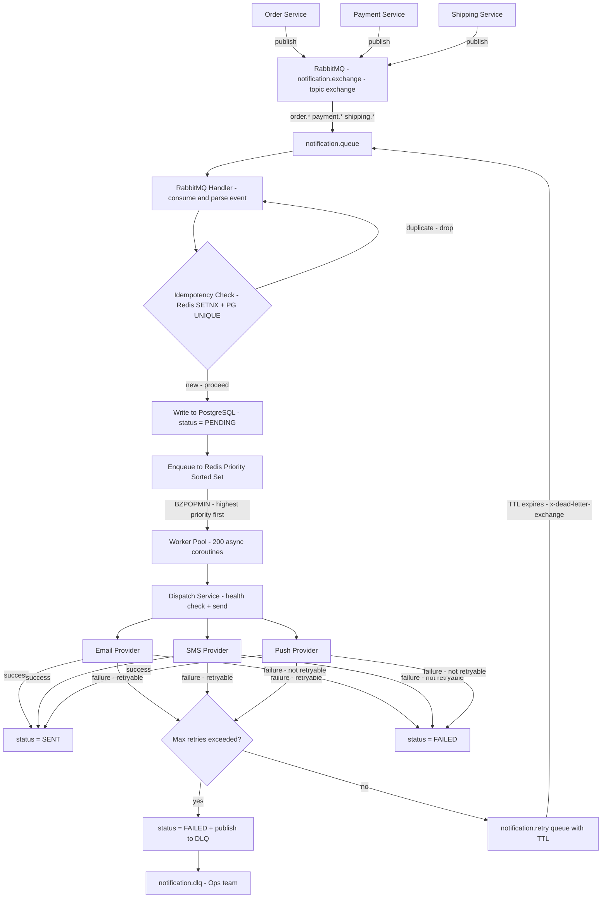
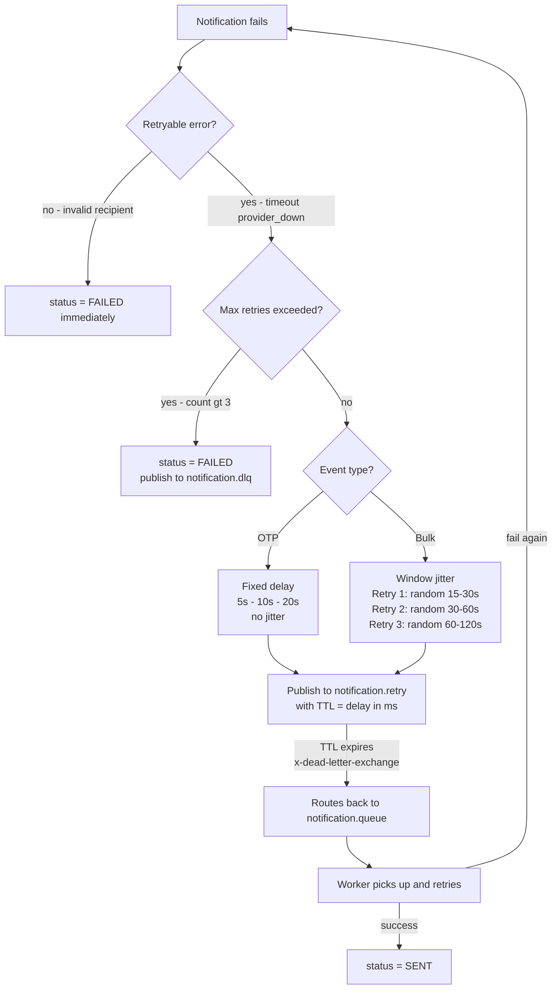

# High Throughput Notification Engine

System design walkthrough : https://www.youtube.com/watch?v=u4VCMDmVyqQ

Code walk through: https://www.youtube.com/watch?v=LuBbQNLmaMs

A production-grade notification service that aggregates events from Order, Payment, and Shipping microservices and dispatches them via Email, SMS, and Push — with guaranteed delivery, priority handling, idempotency, exponential backoff with selective jitter, circuit breaking, and full audit trail.


---

## Problem Statement

Build a notification service that:
- Aggregates events from Order, Payment, Shipping microservices
- Dispatches via Email, SMS, Push
- Handles 50,000 notifications per minute
- Prevents duplicate notifications (Idempotency)
- Handles provider downtime (Retry logic)
- Tracks every notification state (Pending, Queued, Sent, Retrying, Failed)

---

## Functional Requirements

- Accept events from Order, Payment, Shipping services via RabbitMQ
- Dispatch notifications via Email, SMS, Push independently per channel
- Track full state lifecycle of every notification
- Retry failed notifications with exponential backoff and selective jitter
- Prevent duplicate sends even if same event arrives multiple times
- Route permanently failed notifications to Dead Letter Queue
- Expose APIs to query status, list notifications, manually retry failed ones
- Health check endpoints for service and individual providers

---

## Non Functional Requirements

- Handle 50,000 notifications per minute (~834 per second) at peak load
- Each channel failure must not affect other channels (fault isolation)
- No notification must ever be lost even if service crashes mid-processing
- A notification must never be sent twice for the same event
- OTP notifications must be dispatched within seconds
- System must recover automatically when a provider comes back online
- Priority based notifications (OTP given more priority than advertisement mails)
- Service must be stateless and horizontally scalable


---
### Worker Calculation

At 50,000 notifications/min = 834/sec. With average 2 channels per event = 1,668 dispatches/sec. With 100ms average provider latency each worker handles 10/sec. Workers needed = 1,668 ÷ 10 = 167 minimum. We run 200 (configurable via WORKER_COUNT in .env) to provide headroom for spikes.

### How 50,000/min is handled

RabbitMQ buffers incoming events. RabbitMQ handler creates DB rows and enqueues to Redis — very fast, milliseconds per event. 200 async workers pull from Redis sorted set simultaneously. Each takes ~100ms per send. Total capacity = 200 × 10 = 2,000 dispatches/sec. Queue depth stays near zero under normal load. Spikes are absorbed by Redis queue acting as a buffer.
## Event to Channel Mapping

Rather than producers deciding which channels to notify — the notification service owns this logic via EVENT_CHANNEL_MAP. Producer sends one event. Service decides channels. Producer doesn't need to know or care about Email/SMS/Push details.

```
payment_otp_requested  ──► SMS only (OTP must be fast, most secure channel)
payment_confirmed      ──► Email + Push
payment_failed         ──► Email + SMS + Push (urgent, all channels)
order_created          ──► Email + Push
order_cancelled        ──► Email + Push
shipment_dispatched    ──► Email + Push
shipment_delivered     ──► Email + Push
shipment_delayed       ──► Email + SMS (delay is urgent)
```
# Notification System — Message Queue & RabbitMQ (Short Version)

---

## Why Message Queue?

Without queue:

```
Order Service ──► Notification Service
```

Problems:

* Tight coupling (notification down → order fails)
* No buffering (traffic spikes break system)
* No retry guarantee (failures lose events)

With queue:

```
Order Service ──► Queue ──► Notification Service
```
Benefits:
* Decoupled services
* Handles high load (834/sec)
* Reliable (messages persist until ack)

---
## Why RabbitMQ over Kafka?
### Kafka
* Designed for multiple consumers (fan-out)
* Stores events for replay
* Not needed here (only one consumer)

### RabbitMQ
* Designed for one producer → one consumer
* Matches notification system

---

## Key Advantages of RabbitMQ

1. Priority Queue
* High priority (OTP) processed before low priority

2. Retry with TTL + DLX
```
Fail → Retry Queue (TTL) → Back to Main Queue
```

* No polling or scheduler needed

3. Simpler system

* Less complexity than Kafka

### Notification Provider Interface

Every provider implements BaseProvider — a Python abstract base class with three methods: channel property, send(), and health_check(). This is the Strategy Pattern. Swapping MockSMSProvider for real TwilioSMSProvider requires zero changes anywhere else in the system. New channels like WhatsApp just implement the same interface.

### Priority Queue

Redis Sorted Set with score = priority × 10^12 + timestamp_ms. This ensures OTP (priority=1) always processes before marketing email (priority=4). Within same priority, older notifications process first (FIFO). BZPOPMIN gives atomic pop — two workers can never get the same notification.

### Partial Failure Handling

Each event creates independent notification rows per channel. payment_failed creates three rows — email, sms, push. Each has its own status, retry_count, next_retry_time. SMS failing never blocks email or push. Workers process each independently. This is the core of partial failure isolation.

### Idempotency — Two Layer Protection

Layer 1 — Redis SETNX on idempotency_key. Atomic, 0.1ms, blocks duplicates before they touch DB. Producer sends one base key. Service generates per-channel keys internally. Layer 2 — PostgreSQL UNIQUE constraint on idempotency_key. Safety net if Redis restarts. Both layers together guarantee exactly-once delivery regardless of network retries, RabbitMQ redelivery, or consumer crashes.

---

## Architecture

### HLD — System Overview




---

## LLD — Implementation Details

### Layered Architecture

```
Controller  ──► HTTP layer only, no business logic
Manager     ──► business logic, orchestration
Repository  ──► DB queries only
Service     ──► queue and dispatch logic
Provider    ──► channel specific sending
Handler     ──► RabbitMQ consumer and exception handling
Worker      ──► async worker pool and retry reaper
```


## Database Design
 
### Schema — notifications table
 
```sql
CREATE TABLE notifications (
    id               BIGSERIAL PRIMARY KEY,
    idempotency_key  VARCHAR(255) UNIQUE NOT NULL,
    source_service   INTEGER NOT NULL,   -- 1=order, 2=payment, 3=shipping
    event_type       INTEGER NOT NULL,   -- 1=order_created ... 8=shipment_delayed
    channel          INTEGER NOT NULL,   -- 1=email, 2=sms, 3=push
    recipient        VARCHAR(255) NOT NULL,
    priority         INTEGER NOT NULL,   -- 1=critical, 2=high, 3=medium, 4=low
    status           INTEGER NOT NULL,   -- 1=pending, 2=queued, 3=sent, 4=failed, 5=retrying
    error_code       INTEGER,            -- 1=timeout, 2=provider_down, 3=rate_limited, 4=invalid_recipient, 5=invalid_token, 6=unknown
    retry_count      INTEGER DEFAULT 0,
    next_retry_time  TIMESTAMPTZ,
    external_id      VARCHAR(255),       -- provider reference id e.g. Twilio message SID
    content          JSONB NOT NULL,     -- channel specific payload
    ctime            TIMESTAMPTZ DEFAULT NOW(),
    mtime            TIMESTAMPTZ,
    stime            TIMESTAMPTZ         -- sent time, set when status = SENT
);
 
-- indexes
CREATE INDEX idx_notifications_status_priority ON notifications (status, priority);
CREATE INDEX idx_notifications_channel ON notifications (channel);
CREATE INDEX idx_notifications_event_type ON notifications (event_type);
```
 
### Content JSONB structure per channel
 
```json
Email:  { "subject": "Order confirmed", "body": "Your order #123 is confirmed." }
SMS:    { "body": "Payment failed. Retry at zoho.com/pay" }
Push:   { "title": "Order Confirmed", "body": "Your order is on its way" }
```
 
### Status lifecycle
 
```
PENDING ──► QUEUED ──► SENT
                  └──► RETRYING ──► SENT
                              └──► FAILED ──► DLQ
```
 
---
### Why PostgreSQL over MongoDB

Notification state is highly structured — every notification has the same shape. ACID guarantees are essential — the entire system's reliability depends on knowing definitively whether a notification was sent or not. MongoDB's weaker transactions are unacceptable here. PostgreSQL's JSONB handles flexible per-channel content without sacrificing relational integrity.

### Why PostgreSQL over MySQL

Better JSONB support for flexible content per channel. Stronger async Python ecosystem via asyncpg. Better connection pooling characteristics for high-write workloads.

### Schema Design Decisions

Integer backed enums for channel, status, priority, source_service, event_type. Faster index lookups — integer comparison is one CPU instruction. Smaller storage — 4 bytes vs variable length strings. Human readable labels handled in the API response layer, not the DB.

JSONB content column for channel-specific data instead of separate tables. Email needs subject and body. SMS needs only body with 160 char limit. Push needs title, body, image_url. One flexible JSONB column eliminates nulls and makes adding new channels trivial — no schema migration needed.

Removed error_message text column — full error details go to application logs. DB stores only error_code as integer enum for retry decision logic. This separation follows the principle — DB stores state, logs store why.

### Timestamps stored as UTC

All timestamps stored as UTC in PostgreSQL. Frontend converts to user's local timezone for display. This is universal — works correctly for any user in any country. No timezone conversion bugs.

### Indexes

Composite index on (status, priority, next_retry_time) . Individual indexes on channel and event_type — used for analytics queries like "show all cancelled orders in last 5 months". Searching by integer is one CPU instruction — critical at billions of rows.

---

## Retry Strategy
 

 
### Why fixed delay does not work — thundering herd
 
Say SMS provider goes down. 10,000 notifications fail simultaneously. With fixed 30 second delay — all 10,000 retry at exactly t+30s. Provider just recovered — gets hit with 10,000 requests at once and crashes again. Retries made the problem worse. This is called a retry storm.
 
### Why exponential backoff alone is not enough
 
Pure exponential backoff without jitter still synchronizes retries. All 10,000 failures happened at the same time. They all compute the same delay. They all retry at the same time. Same thundering herd, just delayed.
 
### Why we use window jitter
 
Jitter adds randomness to spread retries across a time window. Each retry level has its own distinct window — no overlap between levels:
 
```
Retry 1 ──► random between 15 and 30 seconds
Retry 2 ──► random between 30 and 60 seconds
Retry 3 ──► random between 60 and 120 seconds
```
 
10,000 failures spread randomly across their window. Provider sees a steady trickle instead of a spike. This is full window jitter — not 10ms of randomness on a 30 second delay which does practically nothing.
 
### Why OTP uses no jitter
 
Jitter is only needed when many notifications fail simultaneously — bulk events like order confirmation or payment alert where thousands of users are affected at once. OTP is one user, one notification. No thundering herd risk. Adding jitter to OTP adds unnecessary delay to a time-critical payment flow. OTP expires in 5 minutes — every second matters.
 
### Why max 3 retries
 
More than 3 retries means something is fundamentally broken — not a transient blip. Each retry adds load to an already struggling system. After 3 failures route to DLQ and alert ops team. Let them investigate and manually replay once the underlying issue is resolved.
 
### Why polling reaper does not work
 
The obvious approach is a background job that polls DB every N seconds for due retries and re-enqueues them. Two problems:
 
First — wasted resources. Reaper runs every 15 seconds whether there are retries due or not. 2am with zero failures — reaper still wakes up, queries DB, finds nothing, goes back to sleep. Pointless forever.
 
Second — imprecise timing. If retry is due at t+16s and reaper last ran at t+15s — next run is t+30s. Notification waits 14 extra seconds unnecessarily. Effective retry granularity equals the polling interval, not the calculated delay.
 
### Why not Redis keyspace notifications
 
Redis TTL on a key fires an expiry event when the key expires. Subscribe to expiry events, re-enqueue when fired. Precise timing, zero polling.
 
But two problems at scale. Redis documentation explicitly warns that expiry notifications can be delayed when many keys are expiring simultaneously — exactly our failure scenario. And with horizontal scaling — multiple instances subscribe to the same expiry event. Same notification gets re-enqueued by every instance simultaneously. Thundering herd inside your own system.
 
### Why RabbitMQ TTL with x-dead-letter-exchange is the right answer
 
When a notification fails — publish it to `notification.retry` queue with `expiration = delay_ms`. RabbitMQ holds it for exactly that duration. When TTL expires — RabbitMQ automatically routes it to `notification.exchange` via `x-dead-letter-exchange` configuration. Handler picks it up and re-enqueues to Redis priority queue. Worker dispatches again.
 
```
notification.retry queue
    arguments:
        x-dead-letter-exchange: notification.exchange
        x-dead-letter-routing-key: order.retry
```
 
Zero polling. Fires precisely when delay expires. Scales horizontally — RabbitMQ delivers each message to exactly one consumer regardless of how many instances are running. No duplicate retries. No wasted resources during quiet periods.
 
---
 
## Tech Stack Decisions
 
### FastAPI over Django/Flask
 
FastAPI is async by default — same event loop as our 200 workers. No thread blocking. At 834 req/sec async is essential. Django and Flask are synchronous — they block the thread while waiting for DB or providers. FastAPI also provides automatic request validation via Pydantic and generates Swagger docs with zero extra work.
 
### RabbitMQ over Kafka
 
This is a point-to-point problem — one service (notification) consumes these events. Kafka's strength is fan-out where multiple independent services consume the same event stream. RabbitMQ has native priority queue support at broker level which Kafka lacks. RabbitMQ is simpler operationally — one Docker container vs Kafka's Zookeeper/KRaft setup. If in future other teams need the same events, or replay capability is needed for disaster recovery, migrating the ingestion layer to Kafka makes sense while keeping RabbitMQ for internal dispatch.
 
### Redis Sorted Set for priority queue
 
O(log n) insert and atomic BZPOPMIN. Survives service restarts unlike in-memory queue. Multiple worker processes share it safely. Inspectable from outside — can see queue depth and contents. Score formula (priority × 10^12 + timestamp) encodes both priority and arrival order in one number — zero chance of priority collision with any real timestamp value.
 
### asyncio workers over OS threads
 
Notification sending is entirely I/O bound — waiting for HTTP responses from Twilio, SES, FCM. asyncio handles thousands of concurrent in-flight requests with near-zero memory overhead. 200 OS threads would consume 1.6GB RAM. 200 async coroutines consume kilobytes.
 
### SQLAlchemy async over raw SQL
 
ORM maps Python classes to DB tables — same pattern as JPA in Spring Boot. Async SQLAlchemy with asyncpg driver means DB operations never block the event loop. Connection pooling — 20 connections kept open, shared across all requests. Each notification gets its own session for transaction isolation.
 
---
 
## Event to Channel Mapping
 
Rather than producers deciding which channels to notify — the notification service owns this logic via EVENT_CHANNEL_MAP. Producer sends one event. Service decides channels. Producer doesn't need to know or care about Email/SMS/Push details.
 
```
payment_otp_requested  ──► SMS only (OTP must be fast, most secure channel)
payment_confirmed      ──► Email + Push
payment_failed         ──► Email + SMS + Push (urgent, all channels)
order_created          ──► Email + Push
order_cancelled        ──► Email + Push
shipment_dispatched    ──► Email + Push
shipment_delivered     ──► Email + Push
shipment_delayed       ──► Email + SMS (delay is urgent)
```
 
---
 
## Scaling Path
 
50,000/min — current design, single instance, polling reaper, works perfectly.
 
500,000/min — multiple worker instances behind shared Redis queue. Read replicas for analytics queries. PgBouncer for connection pooling.
 
5,000,000/min — Kafka for ingestion layer (fan-out needed at this scale). RabbitMQ DLQ TTL replaces polling reaper. Table partitioning by month for PostgreSQL. Citus for horizontal DB sharding. Kubernetes HPA watching queue depth metric for autoscaling.
 
50,000,000/min — separate microservices per channel. Email service, SMS service, Push service scale independently. Cassandra or DynamoDB for notification state at extreme write volume. Kafka for everything.
 
---
 
## Setup Instructions
 
### Prerequisites
 
Docker Desktop, Python 3.12, Git.
 
### Clone and setup
 
```
git clone <repo>
cd notification-service
cp .env.example .env
```
 
Fill in your values in .env.
 
### Start infrastructure
 
```
docker-compose up -d
```
 
Starts PostgreSQL on 5432, Redis on 6379, RabbitMQ on 5672. RabbitMQ management UI at http://localhost:15672.
 
### Run migrations
 
```
$env:PYTHONPATH = "."
alembic upgrade head
```
 
### Install dependencies
 
```
python -m pip install -r requirements.txt
```
 
### Start service
 
```
uvicorn app.main:app --reload
```
 
API docs at http://localhost:8000/docs.
 
### Run tests
 
```
$env:PYTHONPATH = "."
pytest
```
 
### Simulate events
 
```
python scripts/publisher.py
```
 
Load test:
 
```
python scripts/publisher.py --load-test --count 1000
```
 
---
## Notification Service API
---

## Endpoints
### 1. Create Notification
```
POST /notifications
```
Creates a new notification.
---
### 2. Get Notification by ID
```
GET /notifications/{id}
```
Returns full details of a specific notification.
---
### 3. List Notifications
```
GET /notifications
```
Returns a list of notifications with optional filters.
#### Query Parameters:
* `status` — Filter by notification status (e.g., pending, failed, sent)
* `channel` — Filter by channel (email, SMS, push)
* `source_service` — Originating service
* `event_type` — Type of event
* `limit` — Number of records to return
* `offset` — Pagination offset
---
### 4. Retry Notification
```
POST /notifications/{id}/retry
```
Manually retries a failed notification.
---
### 5. Health Check
```
GET /health
```
Basic service health check.
---
### 6. Provider Health
```
GET /health/providers
```
Returns circuit breaker state for each notification channel/provider.
---
### 7. Metrics
```
GET /metrics
```
Returns system metrics such as:
* Current queue depth
* Processing stats
---

 
## Future Improvements
Integrate real providers — AWS SES for Email, Twilio for SMS, Firebase FCM for Push. Add user preference layer — respect channel opt-outs and quiet hours. Add webhook callback so upstream services know when notification was delivered. Implement circuit breaker with retry budget — stop retrying entirely when error rate crosses 25% as described in production retry patterns. Add per-notification metrics collection to calculate real p50 latency for dynamic retry delay tuning. Kubernetes HPA watching RabbitMQ queue depth for automatic worker scaling.
