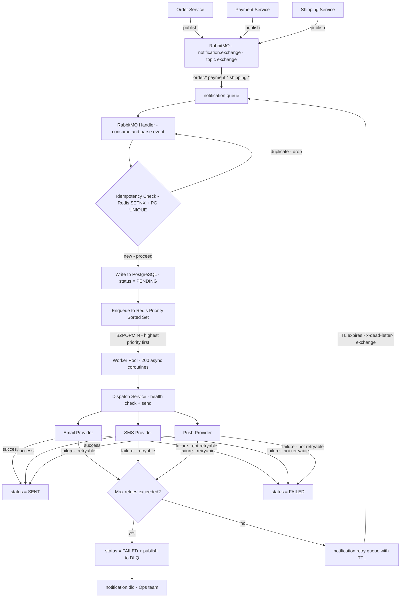
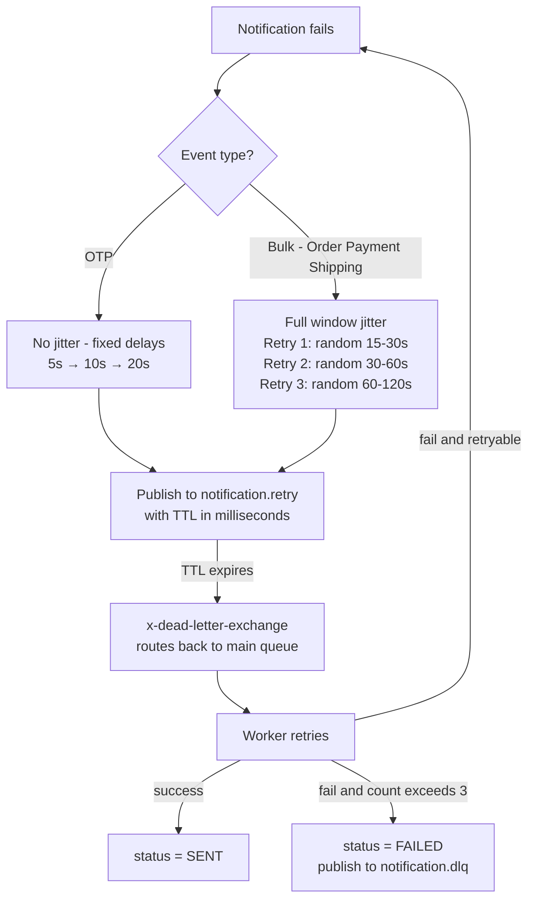

# High Throughput Notification Engine

A production-grade notification service that aggregates events from Order, Payment, and Shipping microservices and dispatches them via Email, SMS, and Push — with guaranteed delivery, priority handling, idempotency, exponential backoff with selective jitter, circuit breaking, and full audit trail.

---

## Problem Statement

Build a notification service that:
- Aggregates events from Order, Payment, Shipping microservices
- Dispatches via Email, SMS, Push
- Handles 50,000 notifications per minute
- Prevents duplicate notifications (Idempotency)
- Handles provider downtime (Retry logic)
- Tracks every notification state (Pending, Queued, Sent, Retrying, Failed)

---

## Functional Requirements

- Accept events from Order, Payment, Shipping services via RabbitMQ
- Dispatch notifications via Email, SMS, Push independently per channel
- Track full state lifecycle of every notification
- Retry failed notifications with exponential backoff and selective jitter
- Prevent duplicate sends even if same event arrives multiple times
- Route permanently failed notifications to Dead Letter Queue
- Expose APIs to query status, list notifications, manually retry failed ones
- Health check endpoints for service and individual providers

---

## Non Functional Requirements

- Handle 50,000 notifications per minute (~834 per second) at peak load
- Each channel failure must not affect other channels (fault isolation)
- No notification must ever be lost even if service crashes mid-processing
- A notification must never be sent twice for the same event
- OTP notifications must be dispatched within seconds
- System must recover automatically when a provider comes back online
- Priority based notifications (OTP given more priority than advertisement mails)
- Service must be stateless and horizontally scalable

---

## Architecture

### HLD — System Overview



### Worker Calculation

At 50,000 notifications/min = 834/sec. With average 2 channels per event = 1,668 dispatches/sec. With 100ms average provider latency each worker handles 10/sec. Workers needed = 1,668 ÷ 10 = 167 minimum. We run 200 (configurable via WORKER_COUNT in .env) to provide headroom for spikes.

### How 50,000/min is handled

RabbitMQ buffers incoming events. RabbitMQ handler creates DB rows and enqueues to Redis — very fast, milliseconds per event. 200 async workers pull from Redis sorted set simultaneously. Each takes ~100ms per send. Total capacity = 200 × 10 = 2,000 dispatches/sec. Queue depth stays near zero under normal load. Spikes are absorbed by Redis queue acting as a buffer.

---

## LLD — Implementation Details

### Layered Architecture

```
Controller  ──► HTTP layer only, no business logic
Manager     ──► business logic, orchestration
Repository  ──► DB queries only
Service     ──► queue and dispatch logic
Provider    ──► channel specific sending
Handler     ──► RabbitMQ consumer and exception handling
Worker      ──► async worker pool and retry reaper
```

### Notification Provider Interface

Every provider implements BaseProvider — a Python abstract base class with three methods: channel property, send(), and health_check(). This is the Strategy Pattern. Swapping MockSMSProvider for real TwilioSMSProvider requires zero changes anywhere else in the system. New channels like WhatsApp just implement the same interface.

### Priority Queue

Redis Sorted Set with score = priority × 10^12 + timestamp_ms. This ensures OTP (priority=1) always processes before marketing email (priority=4). Within same priority, older notifications process first (FIFO). BZPOPMIN gives atomic pop — two workers can never get the same notification.

### Partial Failure Handling

Each event creates independent notification rows per channel. payment_failed creates three rows — email, sms, push. Each has its own status, retry_count, next_retry_time. SMS failing never blocks email or push. Workers process each independently. This is the core of partial failure isolation.

### Idempotency — Two Layer Protection

Layer 1 — Redis SETNX on idempotency_key. Atomic, 0.1ms, blocks duplicates before they touch DB. Producer sends one base key. Service generates per-channel keys internally. Layer 2 — PostgreSQL UNIQUE constraint on idempotency_key. Safety net if Redis restarts. Both layers together guarantee exactly-once delivery regardless of network retries, RabbitMQ redelivery, or consumer crashes.

---

## Database Design

### Why PostgreSQL over MongoDB

Notification state is highly structured — every notification has the same shape. ACID guarantees are essential — the entire system's reliability depends on knowing definitively whether a notification was sent or not. MongoDB's weaker transactions are unacceptable here. PostgreSQL's JSONB handles flexible per-channel content without sacrificing relational integrity.

### Why PostgreSQL over MySQL

Better JSONB support for flexible content per channel. Stronger async Python ecosystem via asyncpg. Better connection pooling characteristics for high-write workloads.

### Schema Design Decisions

Integer backed enums for channel, status, priority, source_service, event_type. Faster index lookups — integer comparison is one CPU instruction. Smaller storage — 4 bytes vs variable length strings. Same pattern used in enterprise systems like Zoho's ProactiveStatus. Human readable labels handled in the API response layer, not the DB.

JSONB content column for channel-specific data instead of separate tables. Email needs subject and body. SMS needs only body with 160 char limit. Push needs title, body, image_url. One flexible JSONB column eliminates nulls and makes adding new channels trivial — no schema migration needed.

Removed max_retries from DB — it is application config not per-row data. Storing the same value 50,000 times per minute wastes storage and is never different per row. Configurable via MAX_RETRIES in .env.

Removed error_message text column — full error details go to application logs. DB stores only error_code as integer enum for retry decision logic. This separation follows the principle — DB stores state, logs store why.

### Naming Conventions

ctime = created time. mtime = modified time. stime = sent time. next_retry_time = when to retry next. Short, consistent, enterprise standard.

### Timestamps stored as UTC

All timestamps stored as UTC in PostgreSQL. Frontend converts to user's local timezone for display. This is universal — works correctly for any user in any country. No timezone conversion bugs.

### Indexes

Composite index on (status, priority, next_retry_time) — used by retry reaper query. Individual indexes on channel and event_type — used for analytics queries like "show all cancelled orders in last 5 months". Searching by integer is one CPU instruction — critical at billions of rows.

---

## Retry Strategy



### Why not simple fixed delay

Fixed delay causes thundering herd. If 10,000 notifications fail simultaneously and all retry at exactly t+30s — the recovering provider gets hit with 10,000 requests at once and crashes again. This is a retry storm — retries making the problem worse not better.

### Exponential backoff

Base formula: 2^(retry_count - 1) seconds. Starts at 1 second — aligns with real provider p50 latency. Each retry doubles the wait. Capped at max_delay per event type.

### Selective jitter

OTP uses no jitter — single user event, no thundering herd risk, fastest retry needed. Bulk events (order, payment, shipping) use full window jitter — random between 1 and max_delay. Spreads 10,000 retries across the entire window instead of synchronizing them. Jitter has to be the full window — 10ms jitter on a 30s backoff does basically nothing.

### Per event type retry config

OTP — max 3 retries, max_delay 30 seconds, no jitter. OTP expires in 5 minutes. Retrying after expiry is pointless. Payment and shipping — max 3 retries, max_delay 1 hour, full jitter. More than 3 retries means something is fundamentally broken. Each retry adds load to a struggling system. Spend retry budget carefully.

### Retry reaper design

Smart dual-interval reaper. Critical notifications (OTP, priority=1) checked every 5 seconds. All others checked every 15 seconds. OTP is time-sensitive — 14 second delay from reaper timing is unacceptable for payment flows. Other notifications are not time-sensitive.

### Polling vs Redis keyspace notifications vs RabbitMQ DLQ TTL

Polling reaper — simple, reliable, predictable. Adequate for 50,000/min where retry volume is low. Effective retry granularity equals reaper interval.

Redis keyspace notifications — precise timing, fires exactly when TTL expires. BUT Redis documentation explicitly warns that expiry notifications can be delayed under high key volume. Additionally pub/sub means all horizontal instances receive the same event — same notification retried by multiple workers simultaneously.

RabbitMQ DLQ TTL — precise, reliable, scales horizontally naturally. Best approach for 10x+ scale. At current 50,000/min the polling reaper query touches only ~500 rows every 15 seconds — trivial for PostgreSQL with proper index.

Decision — polling reaper for current scale. RabbitMQ DLQ TTL as the upgrade path when scaling beyond 500,000/min.

### About p50 and reaper interval

p50 based delays only work with precise scheduling. Our polling reaper has 15 second granularity — making 1-2 second delays irrelevant. Effective minimum retry delay equals the reaper interval. The delay calculation still matters for jitter — spreading retries across a time window even if the minimum is 15 seconds.

---

## Tech Stack Decisions

### FastAPI over Django/Flask

FastAPI is async by default — same event loop as our 200 workers. No thread blocking. At 834 req/sec async is essential. Django and Flask are synchronous — they block the thread while waiting for DB or providers. FastAPI also provides automatic request validation via Pydantic and generates Swagger docs with zero extra work.

### RabbitMQ over Kafka

This is a point-to-point problem — one service (notification) consumes these events. Kafka's strength is fan-out where multiple independent services consume the same event stream. RabbitMQ has native priority queue support at broker level which Kafka lacks. RabbitMQ is simpler operationally — one Docker container vs Kafka's Zookeeper/KRaft setup. If in future other teams need the same events, or replay capability is needed for disaster recovery, migrating the ingestion layer to Kafka makes sense while keeping RabbitMQ for internal dispatch.

### Redis Sorted Set for priority queue

O(log n) insert and atomic BZPOPMIN. Survives service restarts unlike in-memory queue. Multiple worker processes share it safely. Inspectable from outside — can see queue depth and contents. Score formula (priority × 10^12 + timestamp) encodes both priority and arrival order in one number — zero chance of priority collision with any real timestamp value.

### asyncio workers over OS threads

Notification sending is entirely I/O bound — waiting for HTTP responses from Twilio, SES, FCM. asyncio handles thousands of concurrent in-flight requests with near-zero memory overhead. 200 OS threads would consume 1.6GB RAM. 200 async coroutines consume kilobytes.

### SQLAlchemy async over raw SQL

ORM maps Python classes to DB tables — same pattern as JPA in Spring Boot. Async SQLAlchemy with asyncpg driver means DB operations never block the event loop. Connection pooling — 20 connections kept open, shared across all requests. Each notification gets its own session for transaction isolation.

---

## Event to Channel Mapping

Rather than producers deciding which channels to notify — the notification service owns this logic via EVENT_CHANNEL_MAP. Producer sends one event. Service decides channels. Producer doesn't need to know or care about Email/SMS/Push details.

```
payment_otp_requested  ──► SMS only (OTP must be fast, most secure channel)
payment_confirmed      ──► Email + Push
payment_failed         ──► Email + SMS + Push (urgent, all channels)
order_created          ──► Email + Push
order_cancelled        ──► Email + Push
shipment_dispatched    ──► Email + Push
shipment_delivered     ──► Email + Push
shipment_delayed       ──► Email + SMS (delay is urgent)
```

---

## Scaling Path

50,000/min — current design, single instance, polling reaper, works perfectly.

500,000/min — multiple worker instances behind shared Redis queue. Read replicas for analytics queries. PgBouncer for connection pooling.

5,000,000/min — Kafka for ingestion layer (fan-out needed at this scale). RabbitMQ DLQ TTL replaces polling reaper. Table partitioning by month for PostgreSQL. Citus for horizontal DB sharding. Kubernetes HPA watching queue depth metric for autoscaling.

50,000,000/min — separate microservices per channel. Email service, SMS service, Push service scale independently. Cassandra or DynamoDB for notification state at extreme write volume. Kafka for everything.

---

## Setup Instructions

### Prerequisites

Docker Desktop, Python 3.12, Git.

### Clone and setup

```
git clone <repo>
cd notification-service
cp .env.example .env
```

Fill in your values in .env.

### Start infrastructure

```
docker-compose up -d
```

Starts PostgreSQL on 5432, Redis on 6379, RabbitMQ on 5672. RabbitMQ management UI at http://localhost:15672.

### Run migrations

```
$env:PYTHONPATH = "."
alembic upgrade head
```

### Install dependencies

```
python -m pip install -r requirements.txt
```

### Start service

```
uvicorn app.main:app --reload
```

API docs at http://localhost:8000/docs.

### Run tests

```
$env:PYTHONPATH = "."
pytest
```

### Simulate events

```
python scripts/publisher.py
```

Load test:

```
python scripts/publisher.py --load-test --count 1000
```

---

## APIs

POST /notifications — create notification (used by consumers or direct integration).
GET /notifications/{id} — full details of one notification.
GET /notifications — list with filters: status, channel, source_service, event_type, limit, offset.
POST /notifications/{id}/retry — manually retry a failed notification.
GET /health — service health check.
GET /health/providers — circuit breaker state of each channel.
GET /metrics — current queue depth.

---

## Future Improvements

Replace polling reaper with RabbitMQ DLQ TTL for precise retry timing at higher scale. Add Redis AOF persistence so queue survives Redis restarts. Integrate real providers — AWS SES for Email, Twilio for SMS, Firebase FCM for Push. Add user preference layer — respect channel opt-outs and quiet hours. Add webhook callback so upstream services know when notification was delivered. Implement circuit breaker with retry budget — stop retrying entirely when error rate crosses 25% as described in production retry patterns. Add per-notification metrics collection to calculate real p50 latency for dynamic retry delay tuning. Kubernetes HPA watching RabbitMQ queue depth for automatic worker scaling.
